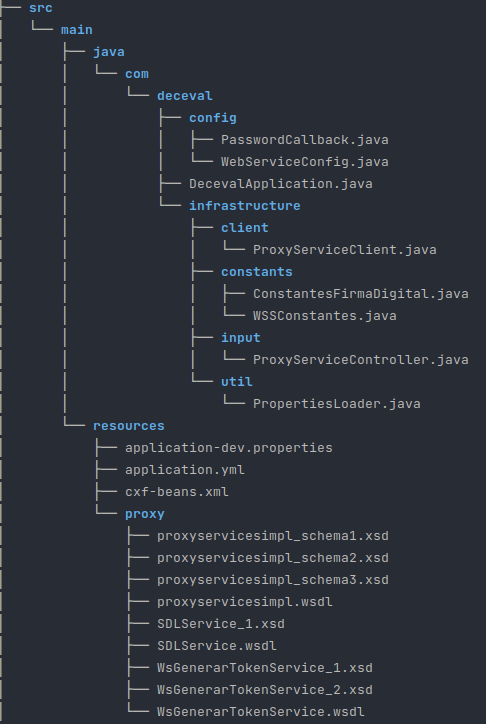
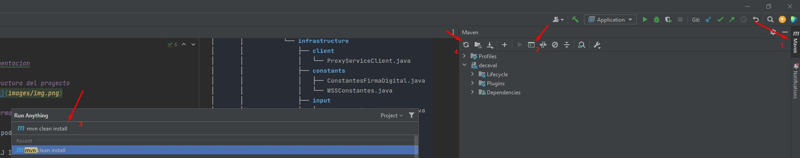
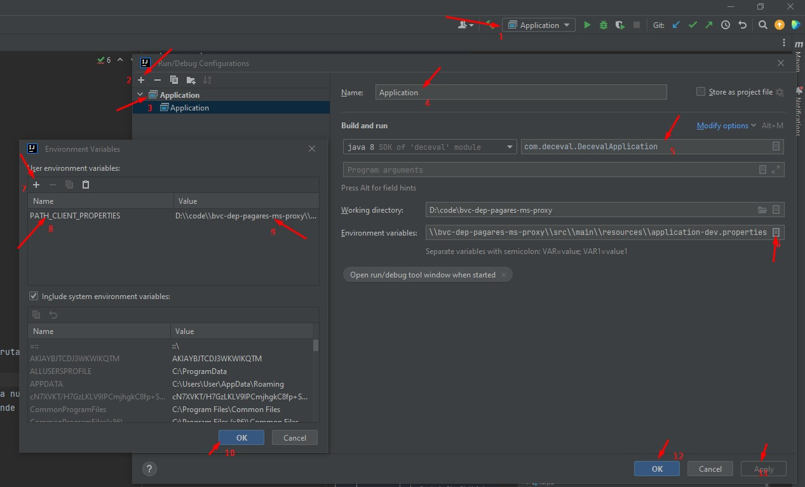
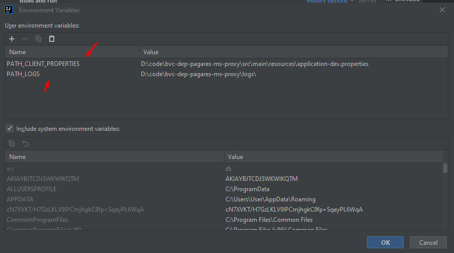
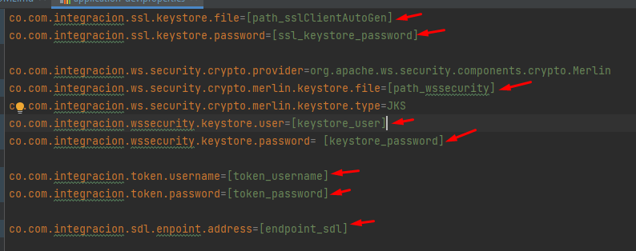
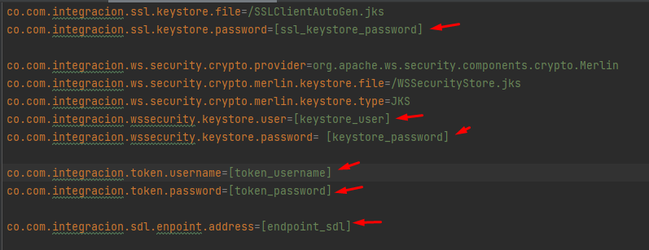

# Proxy

### Documentacion

#### Estructura del proyecto


#### Información previa

Antes de poder utilizar este proyecto debe tener instalado lo siguiente.

- IntelliJ Idea o ide de preferencia
- Maven
- Java JDK8
- SoapUI

#### Inicializar proyecto
1. Realizar la descarga del repositorio.
2. Compilar el proyecto para poder obtener generar los recursos necesarios de cxf
comando ```maven clean install```
   - 
3. Agregar la siguiente variable de entorno PATH_CLIENT_PROPERTIES la cual debe contener la ruta de nuestro client.properties,
el cual debe tener la misma estructura de nuestro application-dev.properties
   - Adicional agregar la variable de entorno PATH_LOGS la cual tendra la ruta de nuestro almacenamiento de logs
   - Esta configuracion es para intellij para desplegar el aplicativo debera crear esta variable de entorno de forma local en su 
      sistema operativo de preferencia
   - 
   - 
4. Previamente, se deben tener configurados las llaves jks, las cuales vamos a agregar(ruta) a nuestro properties
   - Ajustar las rutas y nombres de sus jks generados ssl y wssecurity 
   - 
5. Podemos iniciar el proyecto.(DecevalApplication.java)

#### Docker 
- Para realizar la implementacion de docker en el proyecto actual se encuentra el Dockerfile dentro de nuestro proyecto
  - Para nuestro docker comentamos las líneas de application.yml de nuestro logging
  - Volvemos a compilar el proyecto y procedemos con el resto de las configuraciones
  - Se debe crear la carpeta de keys dentro del proyecto y agregar los dos jks 
  - Ajustar nuestro application-docker.properties, solamente las variables entre [ ]
  - 
  - Al momento de correr los comandos remover los signos [ ] y cambiar las variables internas.
  - Ejecutamos el siguiente comando para crear nuestra imagen de docker
  - ```docker build -t [nombre-imagen:version-imagen] .```
  - y por ultimo ejecutamos el siguiente comando para crear nuestro contenedor
  - ```docker run -d -p 9000:9000 --name [nombre-contenedor] [nombre-imagen:version-imagen]```


